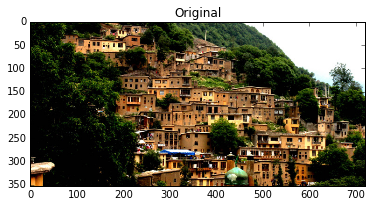
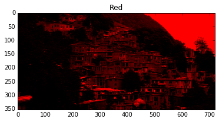
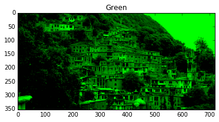
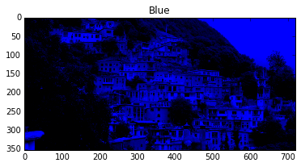
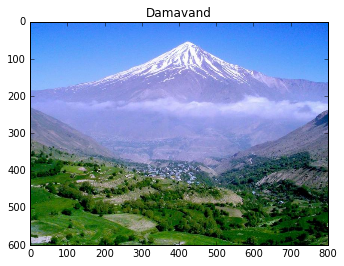
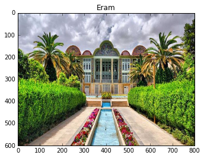
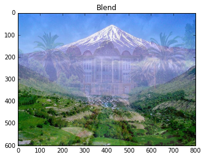

```python
from scipy.misc import imread
from matplotlib import pyplot as plt
import numpy as np
import cv2

img = cv2.imread('/home/hossein/Desktop/cv/cv-lab2/masoleh.jpg')


plt.imshow(img[:,:,::-1])
plt.title('Original')
plt.show()

R = np.zeros(img.shape, dtype=np.uint8)
R[:,:,0] = img[:,:,0]
plt.imshow(R)
plt.title('Red')
plt.show()

G = np.zeros(img.shape, dtype=np.uint8)
G[:,:,1] = img[:,:,1]
plt.imshow(G)
plt.title('Green')
plt.show()

B = np.zeros(img.shape, dtype=np.uint8)
B[:,:,2] = img[:,:,2]
plt.imshow(B)
plt.title('Blue')
plt.show()

# cv2.imshow('blue',B)
# cv2.imshow('green',img[:,:,1])
# cv2.imshow('red',img[:,:,2])
# cv2.waitKey(10)

```














```python
import cv2
import numpy as np
I = cv2.imread('/home/hossein/Desktop/cv/cv-lab2/damavand.jpg')
J = cv2.imread('/home/hossein/Desktop/cv/cv-lab2/eram.jpg')
print I.shape
print J.shape
# K = I.copy()
# K[::1,::1,:] = J[::1,::1,:]/2 + I[::1,::1,:]/2
# K = I/2 + J/2
K = (0.8*I + 0.2*J).astype(np.uint8)

plt.imshow(I[:,:,::-1])
plt.title('Damavand')
plt.show()

plt.imshow(J[:,:,::-1])
plt.title('Eram')
plt.show()

plt.imshow(K[:,:,::-1])
plt.title('Blend')
plt.show()
```

    (600, 800, 3)
    (600, 800, 3)











```python
import cv2
import numpy as np
a = np.array([1,2,3,4,5,6,7,8,9,10], dtype=np.uint8)
print 'A',a
b = np.full((10,), 250, dtype=np.uint8)
print 'B',b
print 'A+B np',a+b
print 'cv2 A+B',cv2.add(a,b)
```

    A [ 1  2  3  4  5  6  7  8  9 10]
    B [250 250 250 250 250 250 250 250 250 250]
    A+B np [251 252 253 254 255   0   1   2   3   4]
    cv2 A+B [[251]
     [252]
     [253]
     [254]
     [255]
     [255]
     [255]
     [255]
     [255]
     [255]]


```python
print (0.8*I).dtype
print (0.8*I).astype(np.uint8).dtype
# cast to convert to int
```

    float64
    uint8


```python
import cv2
import numpy as np
I = cv2.imread('/home/hossein/Desktop/cv/cv-lab2/damavand.jpg')
J = cv2.imread('/home/hossein/Desktop/cv/cv-lab2/eram.jpg')
print I.shape
print J.shape
# K = I.copy()
# K[::1,::1,:] = J[::1,::1,:]/2 + I[::1,::1,:]/2
# K = I/2 + J/2
blend = 0 
while blend<=1.0:
    K = (blend*I + (1-blend)*J).astype(np.uint8)
#     plt.imshow(K[:,:,::-1])
#     plt.title('Blend')
#     plt.show()
    blend+=0.01
    cv2.imshow('Animation',K)
    cv2.waitKey(24)
    
```

    (600, 800, 3)
    (600, 800, 3)
